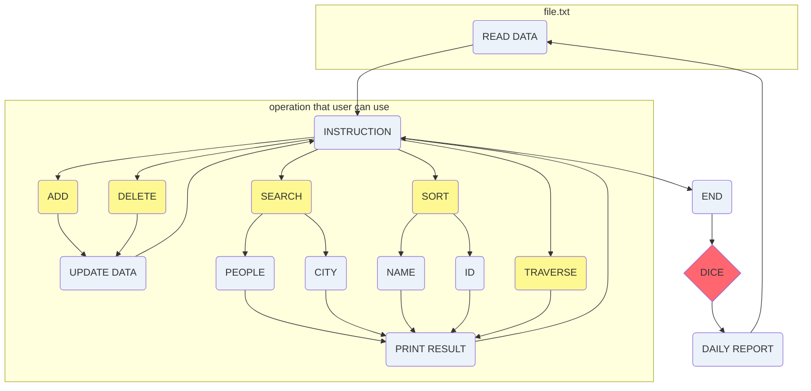
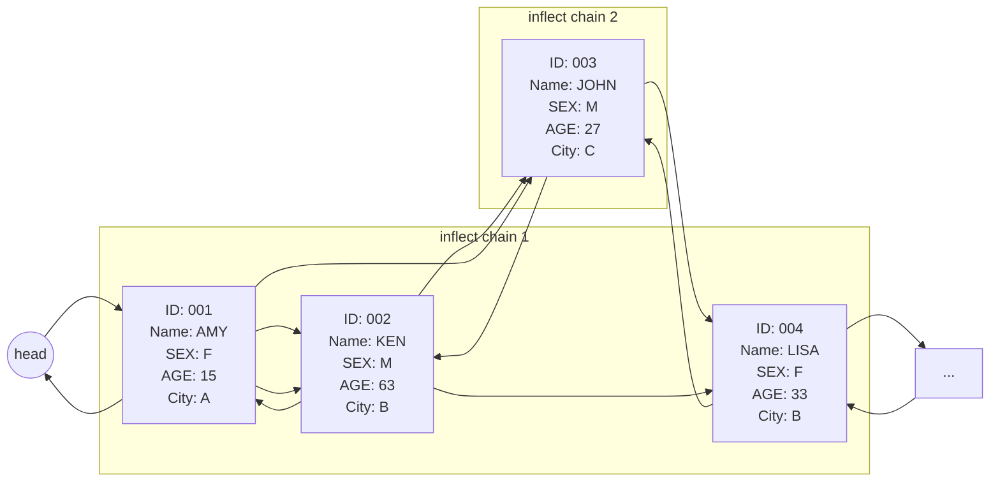
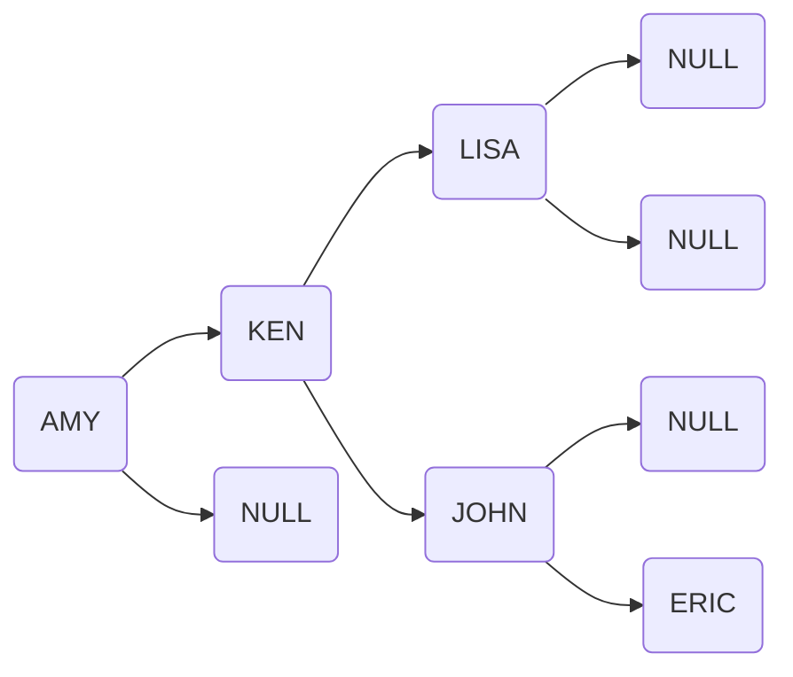
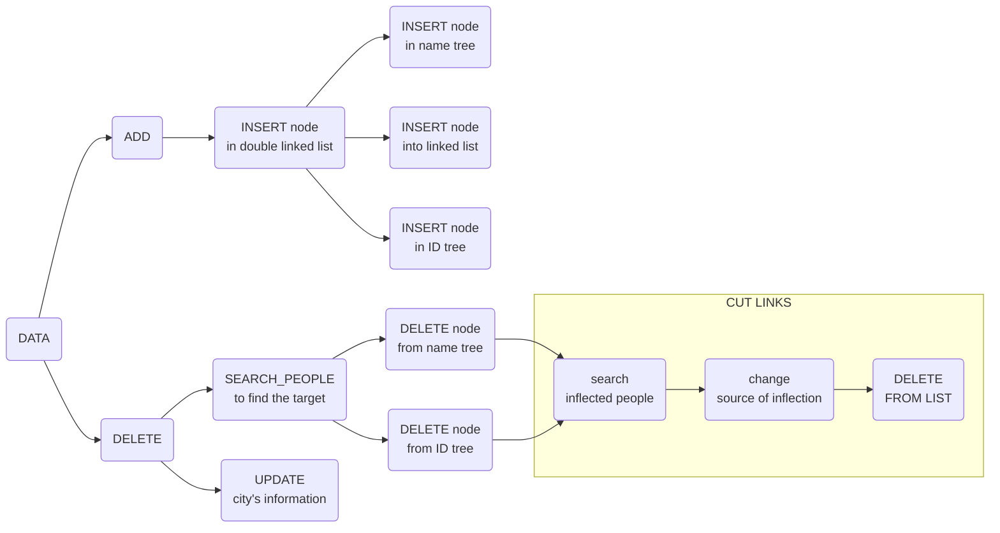
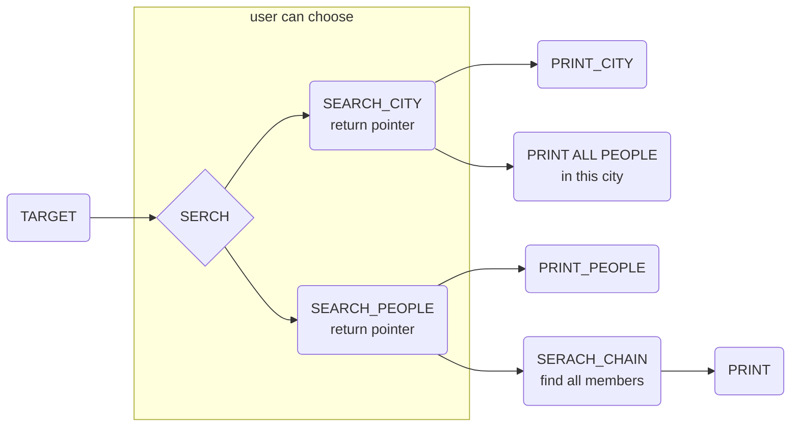
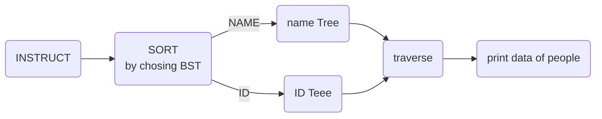
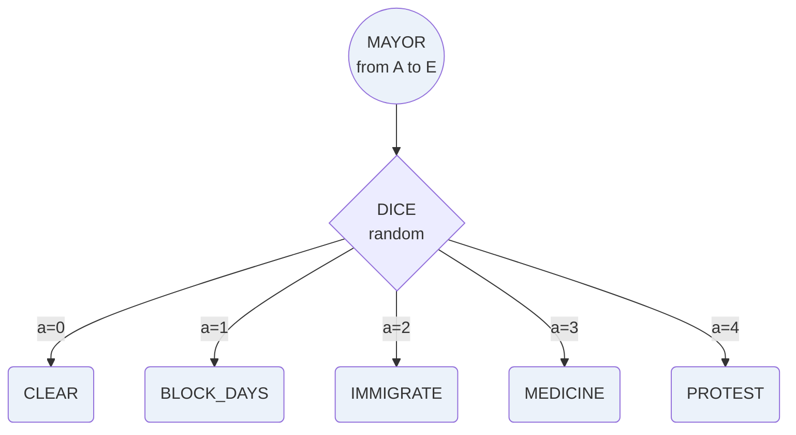

### <center><b>FINAL PROJECT</b></center>

---
- Team: 拜託讓我過
- Members: 
    - 王彥珽(409410016)
    - 蔡承佑(409410020) 
    - 丁天鈞(409410056)
    - 吳承濬(408410059)
---

<br>

## INTRODUCTION

### **1. INTRODUCE**
1. In response to new disease breakout,throughtout the country everyone is in a hard time,so we want to build a database to store the disease case. 
2. This database is designed for a new virus,which will store cases among the cities in the linked list and source of inflection list. By the way, this database allow user to add ,delete ,search, sort...etc.


### **2. INFORMATION OF CASE**

| Var                         | Comment                               | Example |
| ---------------------------- | -------------------------------- | ---- |
| (char) ID                    | [INPUT] number of case                  | 001  |
| (char) name                  | [INPUT] name                      | AMY  |
| (char) sex                   | [INPUT] sex                      | F    |
| (int) age                    | [INPUT] age                      | 15   |
| (char) City                  | [INPUT] city name (A,B,C,D,E)           | A    |
| (int) remain_day             | [INPUT] remain isolation day  (start in 7 day)        | 4    |
| (enum) state                  | [RECORD] current state (isolation/gurantine/release for gurantine) | 0    |
| (struct*) pre_inflect_people | [RECORD] previous inflection people(need to find)      | *    |
| (struct*) prev               | [RECORD] previous number                | *    |
| (struct*) next               | [RECORD] next number                | *    |

### **3. INFORMATION OF CITY**

| Var                  | Comment                             | Example |
| --------------------- | ------------------------------ | ---- |
| (int) total_people    | [INPUT] total people                  | 50   |
| (int) inflect         | [count] total inflected people                | 10   |
| (double) inflect_rate | [count] inflected_rate                  | 0.2  |

| CityName |  A  |  B  |  C  |  D  |  E  |
| --- |:---:|:---:|:---:|:---:|:---:|
| TOTAL PEOPLE | 500 | 290 | 670 | 340 | 330 |

### **4. FLOW CHART**


### **5. FILE: "data.txt"**

|  id  | name | sex  | AGE  | CITY | Source of inflection |
| :--: | :--: | :--: | :--: | :--: | :----: |
| 001  | AMY  |  F   |  15  |  A   |* (NULL) |
| 002  | KEN  |  M   |  63  |  B   |  001   |
| 003  | JOHN |  M   |  27  |  C   |  001   |
| 004  | LISA |  F   |  33  |  B   |  002   |
| 005  | ERIC |  M   |  40  |  E   |  004   |


<br>

## PROGRAM DESIGN
1. ListA: Record the informaton in each case by double linked list, and make the inflected chain


2. binary search tree(sort by name)


## BASIC PART

### 1. OVERVIEW
| INSTRUCTION           | RESULT                     |
| :-------------------- | :------------------------- |
| **ADD** 001	IRIS	F	56	E	*      |Add information of IRIS into linked list and recaculate the inflected rate in city E.     |
| **DELETE** John    | Delete the node which named "John" and recaculate the inflected rate in the city.     |
| **SEARCH** |Search data by name,id or city,then print out.  |
| **TRAVERSE**              | Print all the data in the database.       |
| **SORT**                   |Sort the data according name or id,then print the result.            |
| **END**                   | There is no operation that user want to do.              |

### 2. ADD/DELETE


(name and ID tree is used for sort,this part will be illustrated in the sort part)


(1)Function Prototype

```c=
void add();                    //input data from file
void add_user();               //input data from user
void delete();                 //user input a name which want to delete
void release(int day);         //One dat has passed, update the data
void update_city();            //update inflected_rate in each city
```

(2)Brief introduction
**add**:
&emsp;&emsp;`The function will read data from file,then check whether the data is     correct or not. If it is invalid, function will output error message.`
**add_user**:
&emsp;&emsp;`The function is created for user to input.User can input a person with his/her information.The function will check the data's correctness. If there exist invalid data, the functoin will output error message.`
**delete**:
&emsp;&emsp;`The function allow user to input a valid name to delete the data in the system.If user input a invalid name, the function will output error message.`
**release**:
&emsp;&emsp;`This function will change the "remain_day" and "state" in each person.`
**update_city**:
&emsp;&emsp;`The function will recaculate the inflected_rate in each city.`
    
(3)Method
**add/add_user**:
&emsp;&emsp;`Use fgets() to get a line in file/user input, then use strtok() to remove spaces and get informations we need. Check the information whether it is valid or not. If it is invalid, print error message then return. If valid,store the data into linked list.`
**delete**:
&emsp;&emsp;`Use the function search_people_name() below to find the node with name.
Reconnect the linked list ,and update all the pre_inflect_people which user what to delete.`
**release**:
&emsp;&emsp;`traverse all the linked list to update "remain_day" and "state".`
**update_city**:
&emsp;&emsp;`traverse all the city to recaculate the "inflected_rate".`

|  instruct  | total inflect | inflect rate |
| :--------: | :-----------: | :----------: |
| ADD/DELETE |     +1/-1     | RECALCULATE  |

(After add/delete, inflected rate in the city will be recaculated immediately.)

### 3. SEARCH



a. search for city


| City | total inflect | inflect rate | total death | death rate |
| :--: | :-----------: | :----------: | :---------: | :--------: |
|  B   |       2       |    0.018     |      0      |    0.00   
#### #method
1. input city name then search. It'll return city number.

b. serach for people

|  ID  | NAME | SEX  | AGE  | CITY | REMAIN_DAY | STATE |
| :--: | :--: | :--: | :--: | :--: | :--------: | :---: |
| 005  | ERIC |  M   |  40  |  E   |     1      | isolation   |

| NAME |  ID  | SEX  | AGE  | CITY | REMAIN_DAY | STATE |
| :--: | :--: | :--: | :--: | :--: | :--------: | :---: |
| ERIC | 005  |  M   |  40  |  E   |     1      | isolation   |


|      Chain of inflection       |
| :---------------------: |
| 001 -> 002 -> 004 ->005 |
#### #method
1. input people name/ID then search. It'll return people struct pointer.
2. 2.print chain


### 4. SORT



**system: which data do you want to sort: (1) name (2) ID**

(1) sort by name

|  id  | name | sex  | AGE  | CITY | REMAIN_DAY | state |
| :--: | :--: | :--: | :--: | :--: | :--------: | :---: |
| 001  | AMY  |  F   |  15  |  A   |     1      | isolation  |
| 005  | ERIC |  M   |  40  |  E   |     3      | isolation  |
| 003  | JOHN |  M   |  27  |  C   |     4      | isolation  |
| 002  | KEN  |  M   |  63  |  B   |     2      | isolation  |
| 004  | LISA |  F   |  33  |  B   |     6      | isolation  |

(2) sort by id

|  id  | name | sex  | AGE  | CITY | REMAIN_DAY | state |
| :--: | :--: | :--: | :--: | :--: | :--------: | :---: |
| 001  | AMY  |  F   |  15  |  A   |     1      | isolation  |
| 002  | KEN  |  M   |  63  |  B   |     3      | isolation  |
| 003  | JOHN |  M   |  27  |  C   |     4      | isolation  |
| 004  | LISA |  F   |  33  |  B   |     2      | isolation  |
| 005  | ERIC |  M   |  40  |  E   |     6      | isolation  |

(3) Function prototype

```c=
//insert node in tree
void insert(ptrTree, ptrTree, struct people *, char *, int); 
//find place of the node that want to delete in name tree
void find_in_nameTree(ptrTree, ptrTree, char *, int);   
//find place of the node that want to delete in ID tree
void find_in_IDTree(ptrTree, ptrTree, struct people*, int); 
//delete node
void delete_in_tree (ptrTree, ptrTree, int);  
//Inorder Traversal
void traversal(ptrTree);   
//choose name or ID tree and to traversal
void sort();                                                
```
 
#### #method
1. Building the two binary search tree sorting by name and ID.
2. Whenever adding data, implement the **insert** function.
3. Whenever deleting data, implement the **find** function to   find the place in the tree, then implement the **delete** function.
4. Step 2、 3 need to do twice respectively to name BST and ID BST.
5. **The BST and function will describe in more detail in advance part**


### 5. TRAVERSE

To visit all the case in the list, and print the data in each case.
```c=
cur = head;
while(cur!=NULL){
    // PRINT
    cur = cur->next;
}
```


### 6. DAILY REPORT

Before going to the next day, show the state of each city and update the remain day of each people.

| TODAY INFLECT | 
| :-----------: | 
|       5       |

| CITY NAME  |  A   |  B   |  C   |  D   |  E   |
| :---: |:----:|:----:|:----:|:----:|:----:|
| COUNT |  1   |  2   |  1   |  0   |  1   |
|  RATE  | 0.02 | 0.04 | 0.19 | 0.00 | 0.12 |

| REMAIN_DAY |  state   |
| :--------: | :------: |
|     -1     | rejudge all people's state |

<br>

## ADVANCED PART

### **1. binary search tree**
#### **define**
1. All the nodes in left subtree of root node are **less than** the root node.
2. All the nodes in right subtree of root node are **more than** the root node.
3. All nodes in BST fit definition 1 and 2.
4. Two nodes that **values are the same** don't exist in BST.

#### **data struct**
```c=
// Binary Search Tree
typedef struct tree *ptrTree;
typedef struct tree
{
    struct people *data;
    ptrTree left;
    ptrTree right;
} tree;
```

#### **function implement**


```c=
// Binary Search Tree
// front is parent node of node
// node is basis of judgment,in Recursion end, it is the plasce to insert.
// tmp is a pointer that point to the new data (people)
// element is the standard of sort, name or ID.
// big represent the relative size of front and node
// 0 represent front = node = root; -1 represent node is left child node of front; 1 represent right child node
void insert(ptrTree front, ptrTree node, struct people *tmp, char *element, int big)
```
`from root, recursively determining the relative size between the adding data A and data C which current node B's data ponit to`
1. If **root's data is NULL pointer**, make the root data points to A, recursivion end.
2. If **A < C**, current node change to B's left node.
3. If **A > C**, current node change to B's right node.
4. If **B's is NULL pointer**, malloc B and make the B's data points to A, B's left and right point to NULL, recursivion end.

```c=
// front is parent node of node.
// nowNode is basis of judgment,in Recursion end, it is the plasce to delete.
// name is the people data that user want to delete.
// big is the same as the insert function.
void find_in_nameTree(ptrTree front, ptrTree nowNode, char *name, int big)
//is the same as the find_in_nameTree, change name to the pointer point to people.
void find_in_IDTree(ptrTree front, ptrTree nowNode, struct people* target, int big)
```
similar to insert function`
1. If **A < C**, current node change to B's left node.
2. If **A > C**, current node change to B's right node.
3. If **A = C**, implement **delete** function.

```c=
// front is parent node of node.
// nowNode is the plasce to delete.
void delete_in_tree (ptrTree front, ptrTree nowNode, int big)
```
there are four situations (target node = nowNode)
1. Target node is **leaf node**, change front's left or right to NULL by parameter big.
2. Target node **only has left child node**, change front's left or right to target node's child node by parameter big.
3. Target node **only has right child node**, the same as 2.
4. Target node has **two child node**, find the **smallest** node S in **target's right child tree**, change the target's data to point to S, free S.
    <center>*ps. in situation 1、2、3，function will **free** target node*<center/>
```c=
void traversal(ptrTree root)
```
traverse order :


### **2. DICE**
In each day, the mayor can decide which task to perform.
#### #method
Use rand() and srand() to implement.
```c=
#include <time.h>
srand(time(NULL));
int x=rand()%5;
```
- Flow chart


#### **1. CLEAR** 
    (DICE=0) Let all the people in this city be released.

#### **2. BLOCK_DAYS**
    (DICE=1) Block all the news in the city(There won't add any person into the city)
#### # method
add() will judge whether the city is block or not.
#### **3. IMMIGRATE**
    (DICE=2) A person will immigrate to another city.(random(ex:B->C)) Immigrate the first person in the city B appear in the linked list to city C.
#### **4. MEDICINE**
    (DICE=3) It'll take a person's name as a input,he/she will be cured in one thirds
#### **5. PROTEST**
    (DICE=4) Use srand() and rand() to choose a random sentense.
| RANDOM | SENTECE |
| :----: | :-----: |
|0| We did a great job! Keep working! |
|1| City A is totally a mess !! |
|2| We want to attend WTO to have more resources to against the virus. |
|3| Whom spread fake news will be fined 300million dollars |
|4| Humble, humble, more humble |


<br>

## Demonstration
- https://github.com/409410016/finalproject.git
- work distribution:


| NAME             | BASIC | ADVANCED |  OTHERS   |
| ---------------- | ----- | -------- | --------- |
| 王彥珽(409410016) |add,delete,release,update_day| dice(block_days)  |group leader,translate the report     |
| 蔡承佑(409410020) |main,search(search),file i/o|dice(dice,clear,protest)|data.txt,report(graph/chart/architecture)|
| 丁天鈞(409410056) |sort name/ID, delete, insert|Binary Search Tree|translate the report     |
| 吳承濬(408410059) |search(serch_id/name/city)| dice(medicine)  |    |
    